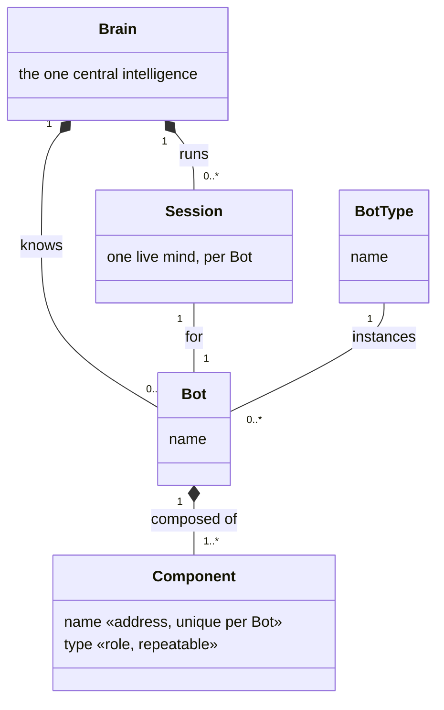
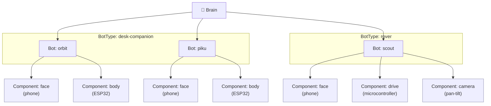

# Terminology & Domain Model — `dock → Bot` rename

**Status doc — survives across sessions. NOT being executed yet** (owner deferred
the code work; this is the frozen plan). If resuming: read [Decided](#decided) +
[Open decisions](#open-decisions-answer-before-coding) first, then the
[staged checklist](#execution-plan-staged-checklist). Nothing in the code has
changed — this doc + the branch `terminology-changes` are the only artifacts.
(Drafted 2026-07-19.)

> **Goal:** a tight, shared vocabulary for the orbit domain — one hierarchy that
> code, docs, and the console all agree on — and a surgical plan to rename the
> existing model to it. The composed unit becomes a **Bot** (today: `dock`).
> Backward compatibility is **not** a constraint; where a rename breaks something
> we clear it manually (see [Break-points](#break-points-to-clear-manually)).
>
> **How this doc was built:** the impact/scale numbers and every `file:line`
> anchor below come from two exhaustive code sweeps of the live tree
> (server+wire, and app+firmware+console) plus direct greps — see
> [Provenance & how to resume](#provenance--how-to-resume) at the bottom. Trust
> but re-verify anchors before editing; the tree may have moved on.

## Terms

| Term | What it is | One-liner |
|---|---|---|
| **Brain** | The one central intelligence. Knows all the Bots; drives each one's reasoning — one **session** per Bot. | The center. There is exactly one. (Today: `orbit-station`.) |
| **Bot** | What a **user** interacts with, as a single coherent entity. Has its own **name**, is of one **BotType**, and is composed of Components. | The unit. (Today: `dock`.) |
| **BotType** | The kind of Bot — `desk-companion`, `rover`, … **Many Bots can share one BotType** (several individually-named desk-companions). | The shape. *(new — see gaps)* |
| **Component** | One physical/logical part of a Bot — a face, a body, a rotating camera. | The part. (Today: `component`/slot.) |
| **Component type** | The kind of part — a face, a body, a camera. | *(labels exist today, not typed — see gaps)* |

**Reading it in one sentence:** one central **Brain** knows and drives many
**Bots**; a user talks to a Bot as one entity, and the Bot is made of
**Components** (a face, a body, …).

## Domain model

**Cardinality, in words:**

- There is exactly **one Brain**. It knows **many Bots** and runs **one Session
  per Bot** (a Session is that Bot's live mind).
- A **BotType** (`desk-companion`, `rover`, …) can have **many Bots** — several
  distinct, individually-named Bots of the same type.
- A **Bot** has its own **name** and is **one BotType**; it is composed of
  **one or more Components**.
- A **Component** has a **name** (unique within its Bot — the address
  `(bot, name)`) and a **type** (its role, repeatable), and belongs to **one
  Bot** (but is movable between Bots).

## Example

One Brain, two BotTypes, three real Bots — showing multiple named Bots of the
same type, and different Components per type.

## Decided

- **The composed unit is a `Bot`.** Chosen over "Node" (which clashes with the
  `node-dock` / `node-rover` folder meaning and with ROS2's "node") — and it's
  already how we talk (`anne-bot`, "always-on robots"). The `node-*` folders are
  legacy names, decoupled from this domain word.
- **BotType is just a name/label** for now. It *may* grow to define more (e.g.
  expected Components) on a need basis — not modeled today.
- **A Component is addressed by its `name`, unique within its Bot.** `(bot,
  component-name)` is the address the Brain routes to. When there's only one of a
  role, the name is just the role (`face`, `body`); when there are several, they
  get distinct names (`hand-left`, `hand-right`).
- **Component `type` is the role** (`face`, `body`, `camera`, `hand`, …), **not**
  hardware — it names *what the Component is for*, not *what runs it*. Unlike
  `name`, `type` is a plain **repeatable** tag: two hands are both `type=hand`.
  Keeping `type` (role) separate from `name` (identity) is what avoids smuggling
  "which one" into the role string. A Component is a comms endpoint that can be
  backed by more than one piece of hardware.
- **`caps` is descriptive only.** The list of what a Component *can do* (e.g.
  `voice face camera` on the phone) is metadata for display — **not** used for
  routing or decisions. Distinct from `type` (the one role that defines it).
- **The Brain's internal parts are out of scope** here — the Brain is the one
  central intelligence; we don't decompose it in this doc unless a reason comes up.

## Open decisions (answer before coding)

Two calls were **not** made and gate the plan. A future agent should get these
answered before touching code:

1. **Wire on `bot`, or keep the wire on `dock`?** The plan assumes the on-the-wire
   JSON key becomes `"bot"` — which is the *only* thing forcing a firmware reflash
   + app rebuild ([Stage 5](#stage-5--wire-rename--client-cutover--coordinated-app--firmware--server)).
   **Alternative:** keep the wire on `dock` forever and translate at the server
   edge (server internals/REST/UI all say `bot`, the bytes stay `dock`). That
   **deletes Stage 5 entirely** — no reflash, no coordinated deploy — at the cost
   of a permanent wire-vs-code vocabulary mismatch (documented, low-harm). This is
   the single biggest cost/benefit fork in the whole rename.
2. **Rename the module folder `modules/docks/` → `modules/bots/`?** Cosmetic but
   ripples import paths. Decide once; noted inline in Stage 2.

Everything else in [Decided](#decided) is settled.

## Rename mapping

| Domain word | Today in code | Rename? |
|---|---|---|
| **Brain** | `orbit-station` / `station` service | **No** — stays `station` for now (out of scope) |
| **Bot** | `dock` (wire field, types, REST, DB, dirs) | **Yes** — the big one |
| **BotType** | — (does not exist) | **New field** |
| **Component** | `component` (slot) | **Keep the word**; add `name` (address) + `type` (role) |
| **Component `type`** | closest to a single `cap` today | **New/clarified** — single repeatable role |
| **`caps`** | `caps: string[]` | **Keep**, demoted to descriptive-only |
| Kotlin package `dev.orbit.dock.*` | 112 files | **No** — package name ≠ domain; out of scope |

## Impact

Scale of the word `dock` today (hits / files):

| Area | Hits | Files | Notes |
|---|---|---|---|
| `orbit-station/server/src` | ~2900 | 173 | incl. 46 test files (churn, low risk) |
| `orbit-station/web/src` | ~380 | 23 | UI mirror + hooks |
| `node-dock/app` | ~630 | 110 | app — but 112 files also carry the `dev.orbit.dock` **package** (NOT renamed) |
| `node-dock/body-firmware` | ~86 | 15 | firmware — forces reflash |
| `docs` | ~1500 | 93 | prose; rename opportunistically, not blocking |

**The rename is NOT one flat swap — it's four coupled surfaces that must move in
lockstep, plus data migration:**

1. **The wire (`dock` field).** `HelloFrame.dock`, `WelcomeFrame.dock`,
   `PresenceFrame.dock`, `ComponentAddr.dock`. Renaming the on-the-wire JSON key
   `"dock"` → `"bot"` **forces the ESP32 firmware (both S3 + C3 binaries) and the
   Android app to be rebuilt/reflashed and shipped together with the server** —
   old clients can't talk to a new server. This is the single biggest
   coordination cost. Sites: firmware `station_link.c:209,380`; app
   `StationLink.kt:194,256` + `RemoteBrain.kt:259`; web-test peer `Brain.tsx:441`.
   **Separately**, the `kind` strings `dock-android-app` / `dock-body-fw[-c3]`
   also embed "dock" and tie to OTA `TARGET_KIND` — deferrable, rename later.

2. **REST namespaces + WS kinds — `dock` is in SIX modules, not just `/api/docks`.**
   Routes: `/api/docks/*`, `/api/brain/:dock/*` (incl. `/api/brain/docks`),
   `/api/conductor/:dock/*`, `/api/perception/:dockId/*` +
   `/api/perception/enrich-audio/:dock/*`, `/api/bodylink/…?dock=`,
   `/api/ego/:dock`. **Plus the WS announce-kind strings `dock-updated` /
   `dock-removed`** on the `station` topic, which the console subscribes to.
   Server routes + WS kinds + every web caller (`Brain.tsx`, `Skills.tsx`,
   `Conductor.tsx`, `PerceptionStudio.tsx`, `useDocks.ts`, `useUnclaimed.ts`)
   change together. (The `station` topic name itself and the `component`/`caps`
   wire fields do **not** change.)

3. **DB + on-disk (migration required — you chose "migrate").** `dock` is the
   key/dir name in **many** places, not one:
   - DB table **`dock_bindings`** (`device_id, dock, last_updated`).
   - Dirs: **`.data/brain/<dock>/`**, **`.data/ego/<dock>/`**,
     **`.data/perception/records/<dock>/`**, feedback filenames
     `.data/feedback/<createdAt>-<dock>-…`, **`.data/docks.json`**.
   - Each needs a one-time migration (rename table column/dirs) or the running
     Bots lose their history. A single migration step must cover all of them.

4. **Env / config identifiers.** `DOCK_NAME` (app build, firmware secrets,
   bootstrap script, tests), `TASK_DOCK` (task supervisor + harness),
   `DOCK_MAX_TOKENS`, `dockManifest` config key.

**Explicitly OUT of scope (do NOT rename — noise, not domain):**

- The Kotlin package `dev.orbit.dock.*` (112 files) — a namespace, not the model.
- The service name `orbit-station` / `station` — decided to stay.
- The `node-dock/` / `node-rover/` folder names — legacy, decoupled.
- Committed `bench/results/*.json` snapshots — durable history, never rewritten.

**The semantic change (not a rename):** giving a Component a `name` distinct from
its `type` (role). Today the slot word (`phone`/`body`) is both identity and role
fused; splitting them is real work in `protocol.ts` + the hub's `(dock,
component)` addressing + the app/firmware hello. For the current fleet
`name == type` (one face, one body), so behavior is unchanged until a Bot has two
of a role.

## Console (browser UI) changes

The **console** is the browser control-plane UI (`orbit-station/web/`). It has
two kinds of change, with very different risk:

**A. User-visible labels — pure text, zero risk, no dependency.** Can even ship
as a standalone relabel commit before the real rename.

| Where | Today | After |
|---|---|---|
| Nav tab + sidebar (`App.tsx`) | "Docks" tab, `#docks` route | "Bots", `#bots` |
| Docks page (`Docks.tsx`) | `<h2>Docks</h2>`, "no docks", claim/move/unbind | "Bots" |
| Overview card (`Overview.tsx`) | `<h3>Docks</h3>` + `#docks` link | "Bots" |
| Side status (`DockStatus.tsx`) | "no docks", `side-dock*` CSS | "Bots" |
| Cost (`Cost.tsx`) | filter `Dock` | `Bot` |
| Brain (`Brain.tsx`) | "dock" label + picker | "Bot" |
| Skills (`Skills.tsx`) | `<h3>Dock</h3>` | "Bot" |
| Tasks (`Tasks.tsx`) | "dock" column | "Bot" |
| Conductor (`Conductor.tsx`) | `<label>Dock</label>` | "Bot" |
| Memory (`Memory.tsx`) | "per-dock store" | "per-Bot store" |
| Perception Studio (`PerceptionStudio.tsx`) | "docks" source labels, `DockHistory` | "Bots" |
| Feedback / Capture | "Dock" labels | "Bot" |

**B. Plumbing — must move in lockstep with the server REST rename (Stage 4).**
Invisible to the user, but breaks the console if it lags the server:

- `web/src/lib/protocol.ts` mirror (`PeerInfo.dock`, `DockInfo`, `DockComponent`,
  `TaskInstance.dock`).
- Hooks `useDocks.ts`, `useUnclaimed.ts` (+ the claim POST body `{deviceId, dock}`).
- Every `/api/docks/*` and `/api/brain/:dock/*` call across the modules above.
- The WS announce kinds `dock-updated` / `dock-removed` the console subscribes to.

**Why the split holds:** the console talks **REST + WS to the server**, never the
wire the firmware/app use — so console plumbing couples to the *server* cutover
(Stage 4), and is fully independent of the firmware/app reflash (Stage 5). Labels
(A) have no dependency at all.

## Execution plan (staged checklist)

Backward-compat is **not** required, but each stage should leave the tree
building + tests green. Ordering minimizes the window where wire/DB are mismatched.

Legend: `[ ]` todo · `[~]` in progress · `[x]` done · **⚠ coordinated** = must
ship with other layers in the same deploy.

### Stage 1 — Doc & mapping (freeze the vocabulary)

- [x] Terms, domain model, example, decisions
- [x] Rename mapping table + impact + console section + staged plan
- [ ] Confirm mapping with a second read before any code moves
- [ ] **Open call:** wire on `bot`, or keep wire on `dock` (kills Stage 5)?

### Stage 2 — Server internals (no wire/REST change yet)

- [ ] `core/protocol.ts` — internal type names (`DockInfo`→`BotInfo`,
      `DockComponent`→…), keep on-wire `dock` key for now
- [ ] `core/websocket-gateway.ts` — `Peer.dock`, `RosterEntry.dock`, claim/
      unclaim/displace, `toAddr` addressing vars
- [ ] `modules/docks/` — directory.ts / index.ts / bindings.ts internals
      (rename the module folder `docks/` → `bots/`? decide)
- [ ] Rename `dock`-named vars/params across other modules (brain, ego,
      perception, bodylink, conductor, observability, feedback, media)
- [ ] Update 46 server test files
- [ ] `npm run build` + `npm test` green

### Stage 3 — Data migration (one-time, idempotent, on boot)

- [ ] DB table `dock_bindings` — rename column `dock`→`bot` (or table→`bot_bindings`)
- [ ] Move dir `.data/brain/<dock>/` → `<bot>/`
- [ ] Move dir `.data/ego/<dock>/` → `<bot>/`
- [ ] Move dir `.data/perception/records/<dock>/` → `<bot>/`
- [ ] Feedback filenames `.data/feedback/<ts>-<dock>-…` (leave old; new format forward)
- [ ] `.data/docks.json` → `.data/bots.json`
- [ ] Migration idempotent + logged; offline-Bot case noted

### Stage 4 — REST + WS-kinds (server + web together; independent of Stage 5)

Console talks REST/WS, not the wire — ships server+web together, **no reflash**.

- [ ] `/api/docks/*` → `/api/bots/*`
- [ ] `/api/brain/:dock/*` + `/api/brain/docks` → `:bot` / `/api/brain/bots`
- [ ] `/api/conductor/:dock/*`
- [ ] `/api/perception/:dockId/*` + `/enrich-audio/:dock/*` + `/utterance-audio/:dock/*`
- [ ] `/api/bodylink/…?dock=` → `?bot=`
- [ ] `/api/ego/:dock/*`
- [ ] **WS kinds `dock-updated` / `dock-removed`** (docks/index.ts) → `bot-*`
- [ ] `web/src/lib/protocol.ts` mirror (`PeerInfo.dock`, `DockInfo`, `DockComponent`, `TaskInstance.dock`)
- [ ] Web hooks `useDocks.ts`, `useUnclaimed.ts` (+ POST body `{deviceId, dock}`)
- [ ] Web plumbing in `Brain.tsx`, `Skills.tsx`, `Tasks.tsx`, `BodyLink.tsx`,
      `Conductor.tsx`, `PerceptionStudio.tsx`, `Ego.tsx`, `DockStatus.tsx`, `Docks.tsx`

### Stage 5 — Wire rename & client cutover ⚠ coordinated (app + firmware + server)

- [ ] `protocol.ts` — rename on-wire JSON key `"dock"` → `"bot"`
      (HelloFrame, WelcomeFrame, PresenceFrame, ComponentAddr)
- [ ] **App** `StationLink.kt:194,256` + `RemoteBrain.kt:259` — hello/welcome `bot`
- [ ] **App** `build.gradle.kts` `DOCK_NAME` BuildConfig + `local.properties.template`
- [ ] **App** `strings.xml` `app_name "orbit dock"` → "orbit bot"
- [ ] **Firmware** `station_link.c:209,380` — `cJSON` add/parse `"bot"`;
      `DOCK_NAME`→`BOT_NAME` (`secrets.h` + `.example`)
- [ ] **Web-test peer** `Brain.tsx:441` hello sends `dock` — flip here too
- [ ] (optional) NVS key `dock` / Android `boundDock` — leave, or accept one re-claim/device
- [ ] Rebuild app, reflash **both** ESP32 binaries (S3 + C3), ship server together
- [ ] Verify a real phone + a real body register on the new key

### Stage 6 — Semantic change: Component name/type + BotType

- [ ] `Component.name` (address, unique per Bot) split from `type` (role);
      add NEW wire field `type` to hello + `DockComponent`
- [ ] Hub addressing uses `(bot, name)`; `type` is a non-unique role tag
- [ ] **Migrate routing off `resolveCap`** — 15 call sites match on `caps` today
      (capture, bodylink×5, brain/rpc, brain/session×4, brain/index×3,
      register-capabilities×2). Switch to `type`-matching (caps now descriptive-only).
- [ ] Add `BotType` field (label-only) to the Bot model + hello/registry
- [ ] `name == type` for existing single-role Bots (no behavior change)
- [ ] `caps` stays descriptive-only metadata (no routing)

### Stage 7 — Console labels & docs

- [ ] Console user-visible labels → "Bots" (see [Console changes](#console-browser-ui-changes)
      table A): `App.tsx` tab+sidebar, `Overview.tsx`, `Cost.tsx`, `Memory.tsx`,
      `Capture.tsx`, `Feedback.tsx`, card labels
- [ ] Sweep `docs/` prose `dock`→Bot where it's the domain word (opportunistic)
- [ ] Re-run `node docs/bin/gen-toc.mjs` on changed long docs

### Stage 8 — Config / env / scripts

- [ ] `TASK_DOCK` → `TASK_BOT` (task supervisor + `_harness/task.ts`)
- [ ] `DOCK_MAX_TOKENS` → `BOT_MAX_TOKENS` (brain/session.ts)
- [ ] `SMOKE_DOCK` → `SMOKE_BOT` (dev harnesses — test-only)
- [ ] `orbit-station/scripts/bootstrap-body.sh` (`DOCK_NAME`)
- [ ] Note: server-side `DOCK_NAME` / `dockManifest` are **doc-comments only**
      (no real env) — swept as prose in Stage 7

### Out of scope (do NOT touch)

- ~~Kotlin package `dev.orbit.dock.*`~~ (112 files — namespace, not domain; renaming `applicationId` breaks OTA)
- ~~Service name `orbit-station` / `station`~~ (stays)
- ~~`node-dock/` / `node-rover/` folder names~~ (legacy)
- ~~`bench/results/*.json`~~ (committed history, never rewritten)

## Break-points to clear manually

These will break at the wire/REST/data cutover and must be handled by hand (not
auto-migrated):

- **Any ESP32 body not reflashed** after stage 5 goes silent (speaks old `dock`
  key). Reflash every board.
- **Any phone app not rebuilt** after stage 5 fails to register. Rebuild + OTA all.
- **Stale `.data` under old names** if a Bot is offline during migration —
  re-run the migration, or it starts fresh under the new name (acceptable per
  "leave old state" if not).
- **External scripts / `bootstrap-body.sh` / smoke harnesses** using `DOCK_NAME`
  or `/api/docks` — update by hand.

## Provenance & how to resume

**For a future agent picking this up cold.**

### What's true as of drafting (2026-07-19)

- **No code has changed.** The only artifacts are this doc and the git branch
  `terminology-changes` (branched off `main`). Nothing is committed on it beyond
  this doc's history.
- The vocabulary in [Terms](#terms) + [Decided](#decided) is agreed with the
  owner. The two [Open decisions](#open-decisions-answer-before-coding) are not.
- The owner **explicitly deferred execution** — do not start renaming without a
  fresh go-ahead.

### How the impact numbers were derived (re-verify before trusting)

The scale table and `file:line` anchors came from, in order:

1. Direct greps for the scale counts — e.g.
   `rg -c '\bdock' <dir>` per area for the hits/files table;
   `rg -o "/api/[^'\"\` ]*dock[^'\"\` ]*|:dock"` for the REST inventory;
   `rg -o "\.data/[A-Za-z0-9_<>/-]+"` for the on-disk paths;
   `rg -o "DOCK_[A-Z_]+|TASK_DOCK|dockManifest"` for env/config ids.
2. Two exhaustive sub-agent code sweeps:
   - **server + wire** — mapped `protocol.ts`, `websocket-gateway.ts`,
     `modules/docks/{directory,index,bindings}.ts`, all `/api/**:dock` routes,
     `.data/<dock>/` dirs, the 15 `resolveCap` call sites, and confirmed
     server-side `DOCK_NAME`/`dockManifest` are **doc-comments only** (no real env).
   - **app + firmware + console** — mapped `StationLink.kt`/`RemoteBrain.kt`/
     `DockBindingCache.kt` hello/welcome, `station_link.c` hello/welcome/NVS,
     `build.gradle.kts`/`secrets.h` `DOCK_NAME`, the `web/src` mirror + hooks +
     every module + nav labels; established that **web couples to the server REST
     rename, not the wire** (why Stage 4 ⊥ Stage 5), and that the Kotlin package /
     `applicationId` must NOT be renamed (breaks OTA identity).

**Anchors are point-in-time.** Before editing any cited `file:line`, re-grep to
confirm it still exists — the tree may have moved. The *shape* of the plan
(4 coupled surfaces + migration + one semantic change) is robust; the exact line
numbers are not.

### The one thing that is a design change, not a rename

[Stage 6](#stage-6--semantic-change-component-nametype--bottype): splitting
Component `name` (address) from `type` (role), and migrating routing off
`resolveCap`(caps) onto `type`. For today's fleet `name == type`, so it's inert
until a Bot has two Components of one role (e.g. two cameras / two hands). Treat
this as a separate, testable change even if the rest of the rename is mechanical.

### Suggested resume order

1. Answer the two [Open decisions](#open-decisions-answer-before-coding).
2. If keeping the wire on `dock` (open decision #1), **strike Stage 5** and the
   firmware/app break-points before starting — it collapses the risk profile.
3. Work the [checklist](#execution-plan-staged-checklist) top-down; each stage is
   independently shippable and should leave `npm run build && npm test` green.
4. When it lands, move this doc out of `inprogress/` to a decision-trace.
